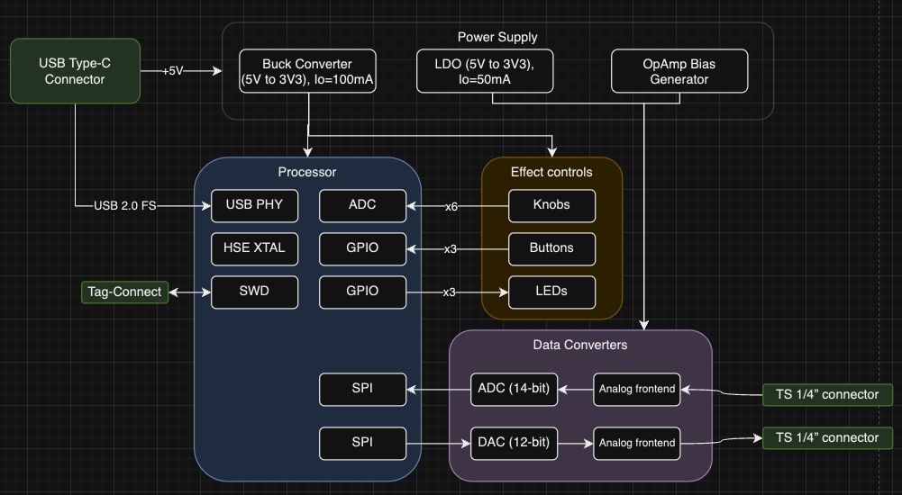

# Guitar Pedal basic requirements

This is the project of a digital guitar pedal. It's a USB-powered, single-channel, low-frequency signal analyser and generator.

* USB-powered: less than 500mA current consumption, 5V input voltage, USB communication for configuring filter parameters.
* Low-frequency: Audio band (20Hz to 20kHz).
* Signal analyzer: captures the guitar signal input with an ADC for the digital generation of effects.
* Signal generator: transforms the generated guitar sound with effect back into analog.

# System requirements

Given basic requirments, let's dive deeper into each subsystem.

### Effect controls

- Two effects controls:
  - One latched pushbutton with LED for activation with 15mcd illuminance.
  - Three knobs for effect parameters.
- One footswitch for effect set.
- One LED with 15mcd illuminance for active mode indication.
- All controls should have ESD protection.

### USB

- **Bit rate:** audio band has max frequency of 20kHz, so sampling rate is at least 40kHz. Given a digital audio signal of 16 bits and a sampling rate of 2 times the minimum (80kHz), the minimum data rate is 1.28Mbits/s.
- **USB Version:** USB 2.0 FS is used: 12Mbits/s.
- **USB Connector:** USB Type C.
- **USB Power-only:** System should also work (pedal effects) with USB without data lines.

### Processor

- **Peripherals:**
  - USB for data streaming.
  - 2x SPI: ADC and DAC.
  - 6x ADC channel for effect knobs.
  - 3x GPIO input for activation buttons.
  - 1-3x GPIO output for LED (depending on the particular button with LED).
- **Core, packaging and brand:**
  - **Core:** Not much power needed, ARM Cortex M0 or M1 is enough.
  - **Package:** Avoid BGA and QFN
  - **Brand:** STM32

### Power supples
- Split digital and analogue supplies
  - Digital: switching supply for efficiency.
  - Analogue: LDO for noise performance.
- Input power from USB:
  - Noisy power rail.
  - Input voltage from 4.5V to 5V.
  - 500mA maximum current if negotiated, 150mA otherwise, so system should consume less than 150mA.

### Converters
- **Interface:** SPI
- **Bit depth:** 14-bit for ADC, 12-bit for DAC
- **Conversion:** Preferrably single-ended
- **Sampling rate:** At least 48kHz

### Analogue sections
- Input:
  - Greater than 1MOhm input buffer, ESD protection, RF filtering.
  - Anti-aliasing filter with cut-off at max half the ADC sampling rate.
- Output:
  - Smaller than 50Ohm outpuf buffer, ESD protection.
  - Anti-aliasing filter with cut-off at max half the DAC sampling rate.

### Miscellaneous
- **Additional connectors:** Tag-connect for firmware development.
- **Audio connectors:** TS 1/4”

## Requirements Draft

